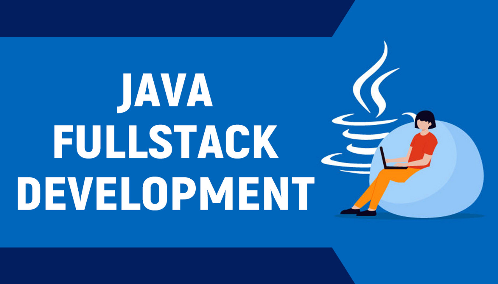

# Java Full-Stack Web Development Internship Tasks


Welcome to the Java FSD Internship tasks repository. This repository serves as a comprehensive record of my accomplishments throughout the FSD Java internship. It houses all tasks, their corresponding code, and detailed explanations in a well-structured manner.



## Table of Contents

- [Internship Details](#internship-details)
- [Repository Structure](#repository-structure)
- [Technologies Used](#technologies-used)
- [Getting Started](#getting-started)
  - [Prerequisites](#prerequisites)
  - [Installation](#installation)
  - [Running the Backend](#running-the-backend)
  - [Running the Frontend](#running-the-frontend)
- [Project Structure](#project-structure)
- [Contributing](#contributing)
- [License](#license)
- [Contact](#contact)

## Internship Details

- **Internship Program** - Java Full-Stack Web Development
- **Company/Organization** - IBM
- **Internship Period** - 5 Months

## Repository Structure

This repository is organized by task. Each task has its own dedicated directory containing the source code and an optional `README.md` file for further explanations.


## Technologies Used

- **Backend:** Java, Spring Boot
- **Frontend:** Java, HTML, CSS, JavaScript
- **Database:** MySQL
- **Code Editor:** Notepad++, Sublime text, VS Code etc
- **Self-paced Content**

## Getting Started

### Prerequisites

- Java 8 or higher
- Node.js and npm
- MySQL

### Installation

1. **Clone the repository:**

   ```bash
   git clone https://github.com/yourusername/java-fsd-internship.git
   cd java-fsd-internship

2. **Install dependencies and start the application:**

    ```bash
    npm install
    npm start


## Contribution Guidelines

Thank you for considering contributing to this project! Here are a few guidelines to get started:

### How to Contribute

1. Fork the repository.
2. Create a new branch for your feature or bugfix.
3. Make your changes.
4. Test your changes thoroughly.
5. Submit a pull request.

### Reporting Issues

If you find a bug or have a feature request, please create an issue on GitHub.

Thank you for your contributions!

## Contact
If you have any questions or suggestions, feel free to reach out to me at keertidvcorai@gmail.com

**Let's Start Coding!**

As my progress through the internship, diligently add my completed tasks to this repository for easy reference and showcasing my progress.

**Happy Coding!**
