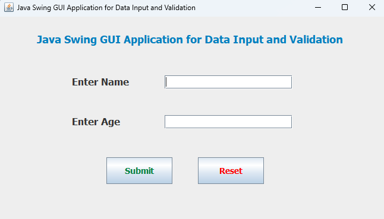
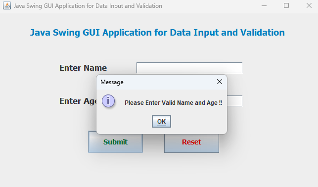
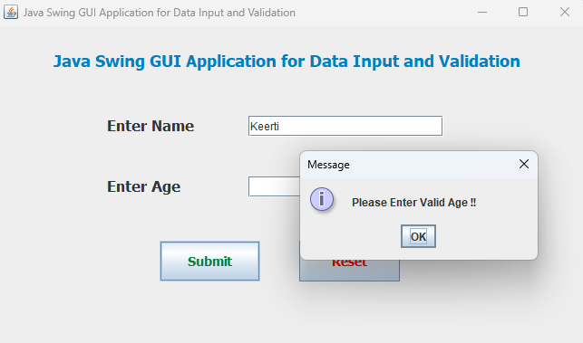
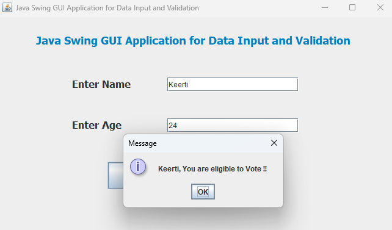
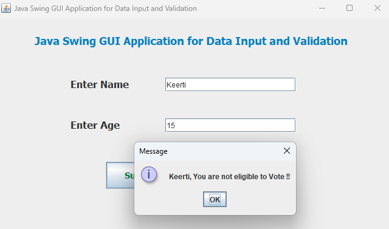
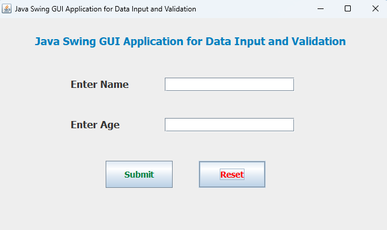

# Java Swing GUI Application for Data Input and Validation

This application is a simple Java Swing GUI that allows users to input their name and age, and validates the input to determine voting eligibility.

## Features

1. **Initial State**: The application opens with empty input fields for "Name" and "Age", and two buttons: "Submit" and "Reset".
   
2. **Empty Fields Validation**: If both fields are empty and the "Submit" button is pressed, an error message is displayed.

3. **Name Field Filled, Age Field Empty**: If the name field is filled but the age field is empty, an error message prompts the user to enter a valid age.

4. **Valid Input, Age 18 or More**: If both fields are filled and the age is 18 or more, a message confirms the user is eligible to vote.

5. **Valid Input, Age Less Than 18**: If both fields are filled and the age is less than 18, a message informs the user they are not eligible to vote.
 
6. **Reset Functionality**: The "Reset" button clears both input fields and any displayed messages.

## Usage

### 1) Initial State of the Application
   - Description: The application is launched showing fields for "Name" and "Age", and buttons for "Submit" and "Reset".
     
   

### 2) Empty Fields Validation
   - Description Message displayed when both fields are empty and the "Submit" button is pressed.
     
   

### 3) Name Field Filled, Age Field Empty
   - Description: Message displayed when the name field is filled, but the age field is empty, and "Submit" is pressed.
     
   

### 4) Valid Input, Age 18 or More
   - Description: Message displayed when both fields are filled, and the age is 18 or more.
     
   

### 5) Valid Input, Age Less Than 18
   - Description: Message displayed when both fields are filled, and the age is less than 18.
     
   

### 6) Reset Functionality
   - Description: Application state after the "Reset" button is pressed, clearing the fields.
     
   

## How to Run

1. **Open the Project in Your IDE: Use an IDE like Eclipse or IntelliJ IDEA.**
2. **Run the Application: Execute the main method in inputdata.java**

