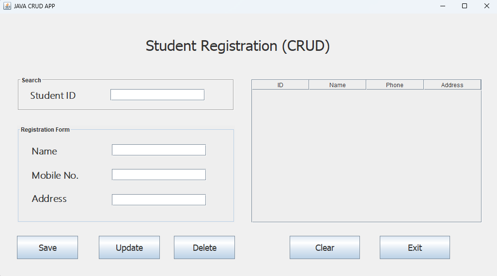
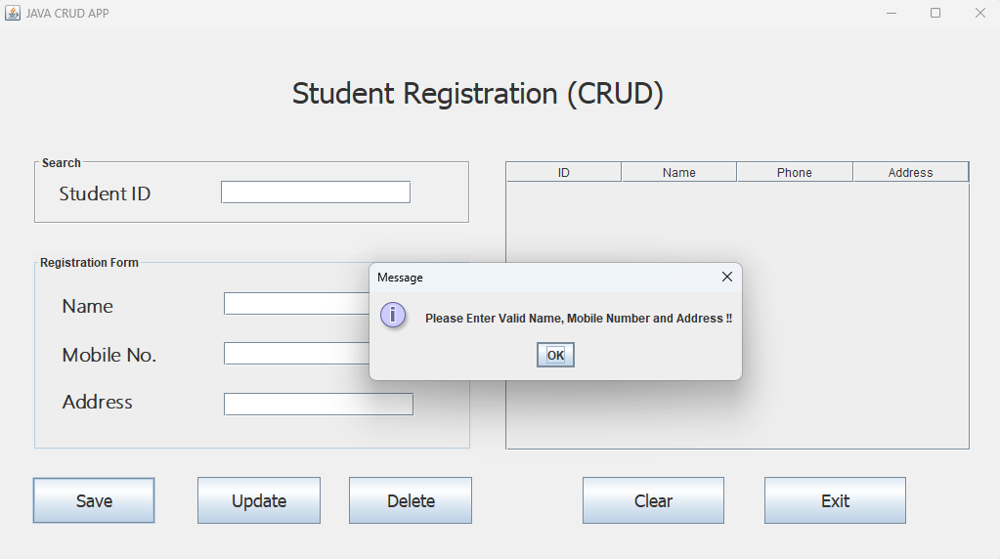
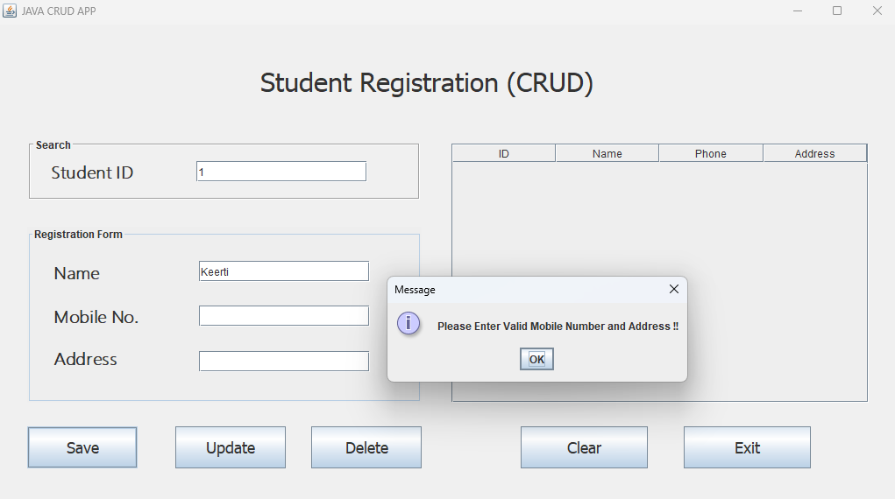
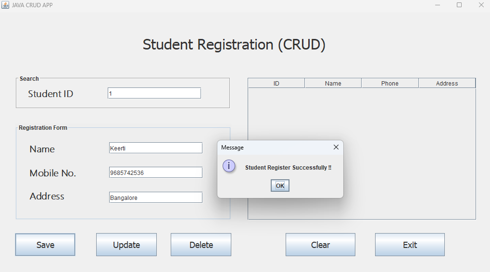
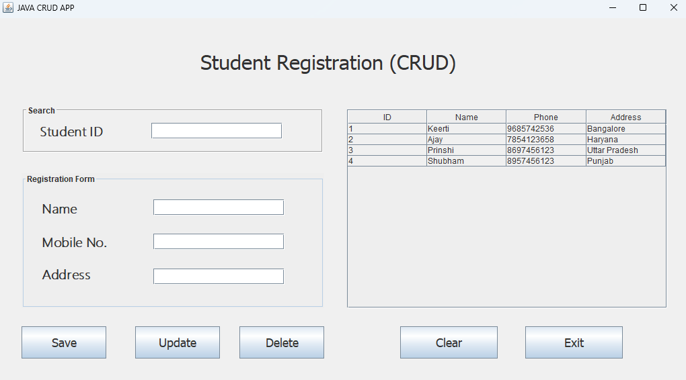
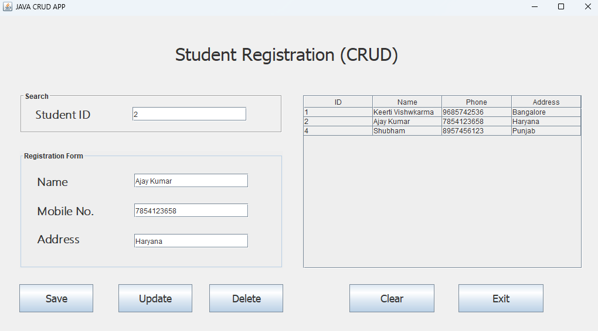
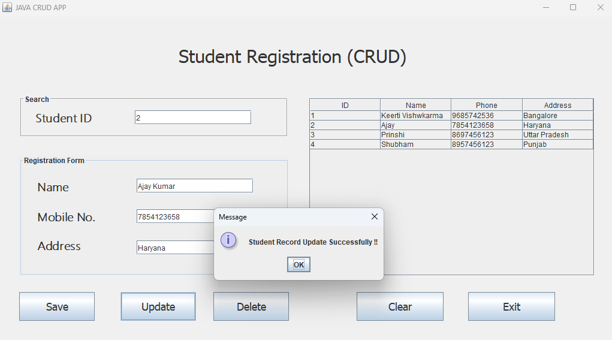
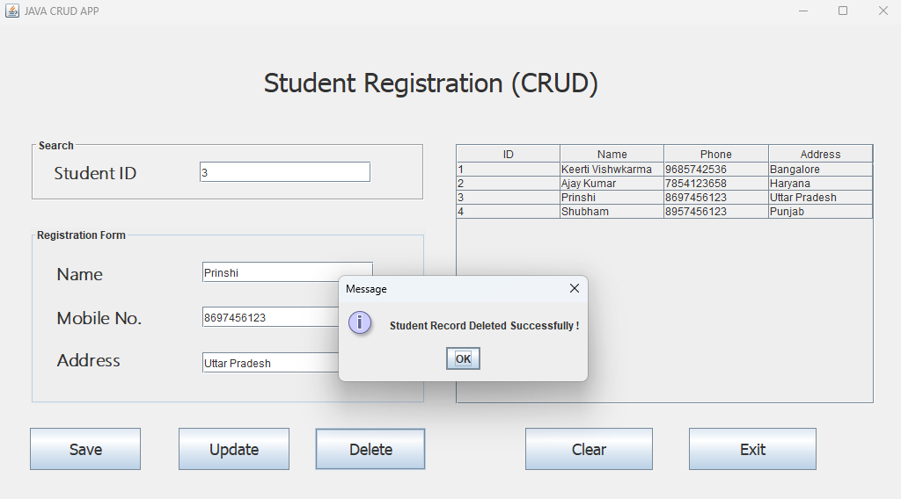
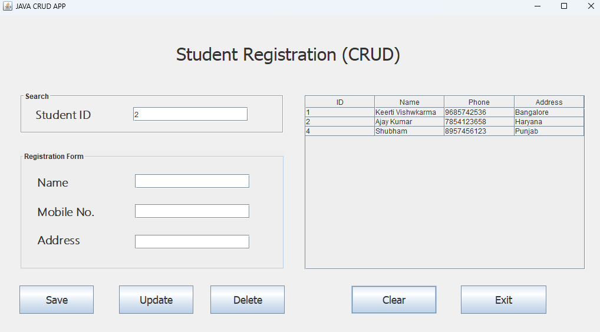

# Student Registration Java CRUD Application

This application is a Java Swing GUI that allows users to perform CRUD operations (Create, Read, Update, Delete) on a student database.

## Features

1. **Create**: Add a new student with ID, Name, Phone, and Address.
2. **Read**: View the list of registered students in a table.
3. **Update**: Modify the details of an existing student.
4. **Delete**: Remove a student from the list.
5. **Clear**: Clear the input fields.
6. **Exit**: Exit the application.

## Screenshots

### 1)	Initial state of the application when it's launched.
When the application is first launched.

### 2)	State when all fields are empty, and the "Save" button is pressed.
When the "Submit" button is pressed without entering any details

### 3)	State when the name field is filled, but the other fields is empty, and "Save" button is pressed.
When only the ID field is filled and the "Submit" button is pressed

### 4)	State when all fields are filled, and "Save" button is pressed. Then data inserted.
When all fields are filled with valid data and the "Submit" button is pressed

### 5)	State when data inserted, and show data in the table.
When all fields are filled with valid data and the "Submit" button is pressed

### 6)	State when Searching for a Student by ID.
When all fields are filled with valid data and the "Submit" button is pressed

### 7)	State when updating a student using the "Update" button.
When all fields are filled with valid data and the "Submit" button is pressed

### 8)	State when deleting a student using the "Delete" button.
When all fields are filled with valid data and the "Submit" button is pressed

###  9) State when fields are Reset using the "Clear" button.
When the "Reset" button is pressed to clear all fields:

## How to Run

1. **Open the Project in Your IDE: Use an IDE like Eclipse or IntelliJ IDEA.**
2. **Run the Application: Execute the main method in student.java**

