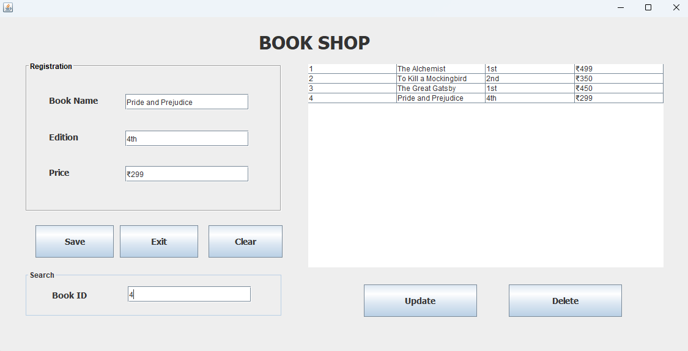

# Book Shop Java CRUD Application

This application is a Java Swing GUI that allows users to perform CRUD operations (Create, Read, Update, Delete) on a book shop database.

## Features

1. **Create**: Add a new book with ID, Book Name, Edition, and Price.
2. **Read**: View the list of registered books in a table.
3. **Update**: Modify the details of an existing book.
4. **Delete**: Remove a book from the list.
5. **Clear**: Clear the input fields.
6. **Exit**: Exit the application.

## Screenshots

### 1)	Initial state of the application when it's launched.
When the application is first launched.

### 2)	State when all fields are filled, and "Save" button is pressed. Then data inserted.
When all fields are filled with valid data and the "Submit" button is pressed.

### 3)	State when data inserted, and show data in the table.
When all fields are filled with valid data and the "Submit" button is pressed.

### 4)	State when Searching for a book by ID.
When all fields are filled with valid data and the "Submit" button is pressed.

### 5)	State when updating a book using the "Update" button.
When all fields are filled with valid data and the "Submit" button is pressed.

### 6)	State when deleting a book using the "Delete" button.
When all fields are filled with valid data and the "Submit" button is pressed.

###  7) Store Data inserted in the database.
Store data in the database.

###  8) State when fields are Reset using the "Clear" button.
When the "Reset" button is pressed to clear all fields.

## How to Run

1. **Open the Project in Your IDE: Use an IDE like Eclipse or IntelliJ IDEA.**
2. **Run the Application: Execute the main method in crud.java**

