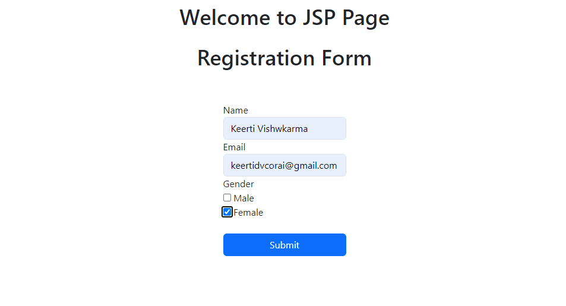

# JSP and HTML Registration Pages

Detailed explanation of two web pages involved in a simple registration process. The first page, index.html, contains the registration form, and the second page, register.jsp, processes and displays the submitted data. Both pages use Bootstrap 5 for styling and layout.

## Details & Screenshots

### 1)	index.html
The index.html page serves as the initial interface where users can fill out their registration information. It includes fields for the user's name, email, and gender.

### 2)	register.jsp
The register.jsp page processes the data submitted from the index.html form and displays a confirmation message with the user's input.

## How to Run

1. **Open the Project in Your IDE: Use an IDE like Eclipse or IntelliJ IDEA.**
2. **Run the Application: Execute the main method in index.html**

